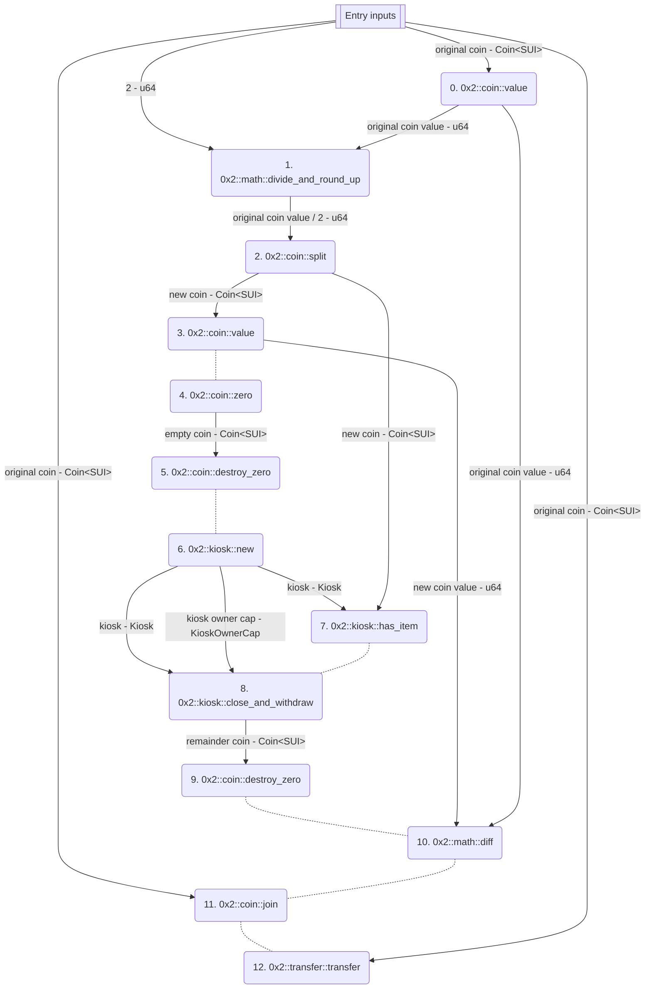

# Sui Programmable Transaction Block Example in Rust

```mermaid
flowchart TD
  ENTRY[[Entry inputs]]
  0(0. 0x2::coin::value)
  1(1. 0x2::math::divide_and_round_up)
  2(2. 0x2::coin::split)
  3(3. 0x2::coin::value)
  4(4. 0x2::coin::zero)
  5(5. 0x2::coin::destroy_zero)
  6(6. 0x2::kiosk::new)
  7(7. 0x2::kiosk::has_item)
  8(8. 0x2::kiosk::close_and_withdraw)
  9(9. 0x2::coin::destroy_zero)
  10(10. 0x2::math::diff)
  11(11. 0x2::coin::join)
  12(12. 0x2::transfer::transfer)

  ENTRY -->|"original coin - Coin#lt;SUI#gt;"| 0
  ENTRY -->|2 - u64| 1
  ENTRY -->|"original coin - Coin#lt;SUI#gt;"| 11
  0 -->|original coin value - u64| 1
  1 -->|original coin value / 2 - u64| 2
  3 -.- 4
  5 -.- 6
  6 -->|kiosk - Kiosk| 7
  6 -->|kiosk - Kiosk| 8
  6 -->|kiosk owner cap - KioskOwnerCap| 8
  7 -.- 8
  8 -->|"remainder coin - Coin#lt;SUI#gt;"| 9
  9 -.- 10
  10 -.- 11
  11 -.- 12
  4 -->|"empty coin - Coin#lt;SUI#gt;"| 5
  2 -->|"new coin - Coin#lt;SUI#gt;"| 3
  3 -->|new coin value - u64| 10
  0 -->|original coin value - u64| 10
  2 -->|"new coin - Coin#lt;SUI#gt;"| 7
  ENTRY -->|"original coin - Coin#lt;SUI#gt;"| 12
```
