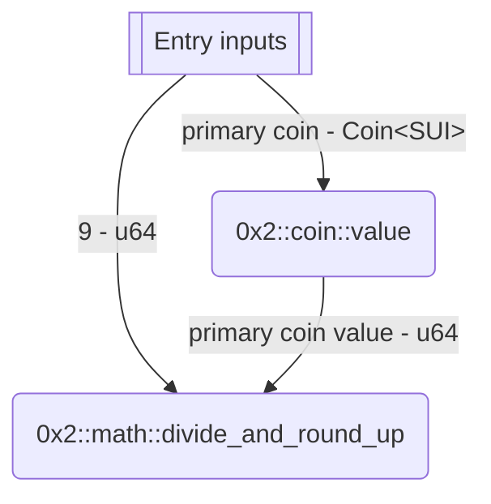
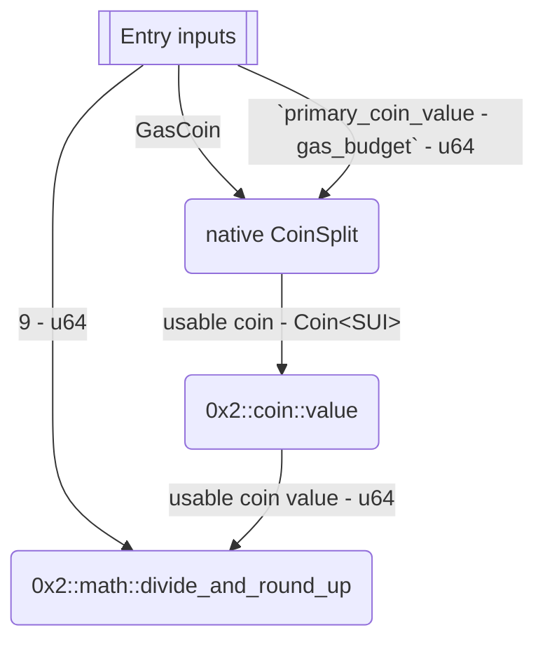

# The Single Gas Coin Conundrum

## Bad

```mermaid
flowchart TD
  ENTRY[[Entry inputs]]
  0(0x2::coin::value)
  1(0x2::math::divide_and_round_up)

  ENTRY -->|"primary coin - Coin#lt;SUI#gt;"| 0
  ENTRY -->|9 - u64| 1
  0 -->|primary coin value - u64| 1
```

## Good

```mermaid
flowchart TD
  ENTRY[[Entry inputs]]
  0(native CoinSplit)
  1(0x2::coin::value)
  2(0x2::math::divide_and_round_up)

  ENTRY -->|GasCoin| 0
  ENTRY -->|`primary_coin_value - gas_budget` - u64| 0
  0 -->|"usable coin - Coin#lt;SUI#gt;"| 1
  ENTRY -->|9 - u64| 2
  1 -->|usable coin value - u64| 2
```
